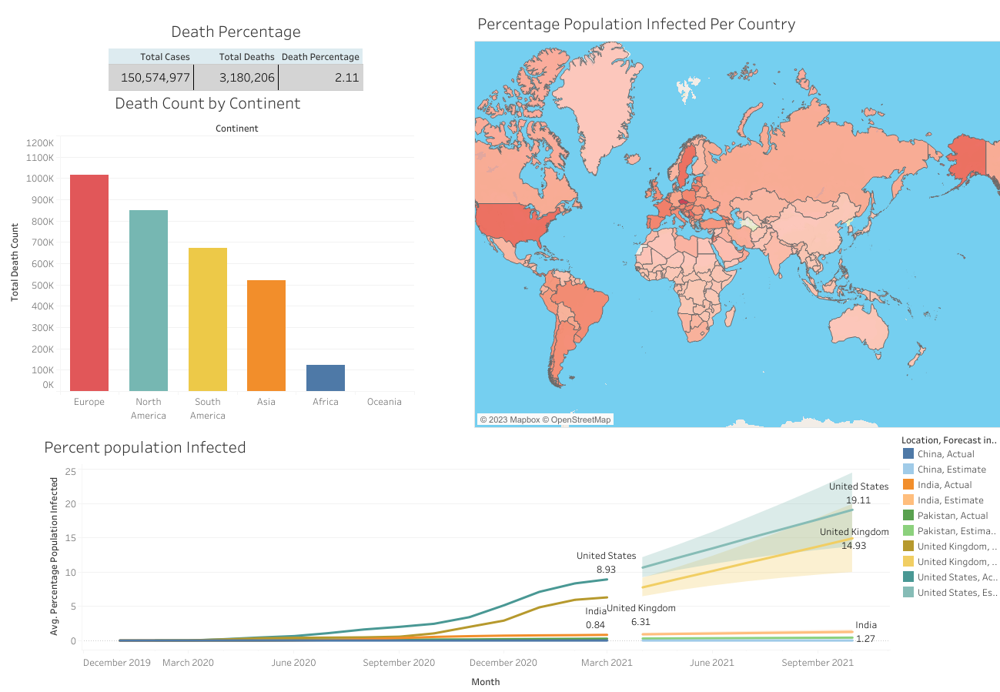

# COVID-19 Visualization Project
This project aims to visualize various aspects of the COVID-19 pandemic using data from multiple sources. The visualizations include a table, column chart, line chart, and map, providing insights into death percentage rates, total death counts by continent, actual infected population and its forecast, and the percentage of the population infected per country
## Visualizations
##Death Percentage Rate Table
The "Death Percentage Rate" table displays the death percentage rate for different regions and countries affected by COVID-19. It provides an overview of the severity of the virus's impact in various areas.

## Total Death Count by Continent (Column Chart)
The "Total Death Count by Continent" column chart presents the total number of deaths attributed to COVID-19 for each continent. This visualization helps understand the comparative impact of the pandemic across different parts of the world.

## Actual Infected Population and Forecast (Line Chart)
The "Actual Infected Population and Forecast" line chart illustrates the actual number of infected individuals over time, along with a forecasted projection. This visualization assists in analyzing the trend of infections and predicting potential future scenarios.

## Percentage Population Infected by Country (Map)
The "Percentage Population Infected by Country" map represents the percentage of the population infected by COVID-19 in each country. This visual depiction provides insights into the spread and impact of the virus at a country level.

## Insights
The death percentage rate table reveals the variation in fatality rates across different regions and countries, highlighting areas with higher mortality rates.
The column chart of total death counts by continent indicates the regions most affected by COVID-19 in terms of fatalities, allowing for comparisons between continents.
The line chart displaying actual infected population and forecast helps identify the growth trajectory of infections and potential future scenarios.
The map illustrating the percentage population infected per country shows the varying impact of the virus globally, highlighting countries with high infection rates relative to their population size.
These visualizations provide valuable insights into the COVID-19 pandemic, helping understand its severity, geographical distribution, and projected trends.

Please note that the data used for these visualizations is sourced from reliable and up-to-date COVID-19 datasets.

## Technologies Used
The visualizations in this project are created using Tableau, a powerful data visualization tool. Tableau allows for the creation of dynamic and interactive visual representations of data.

## Link 
Here is the link of this dashboard where you can interact and make changes and design your own insights.

[Link](https://public.tableau.com/app/profile/ali.yaqteen/viz/CovidDashboard_16854221777160/Dashboard1?publish=yes)

